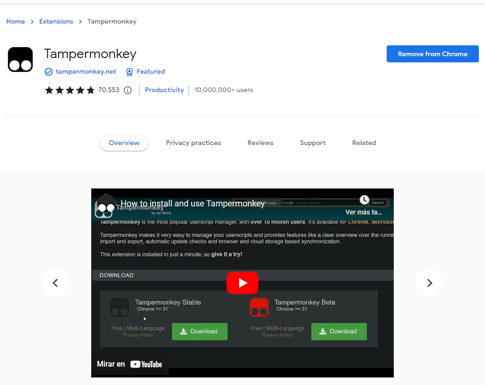
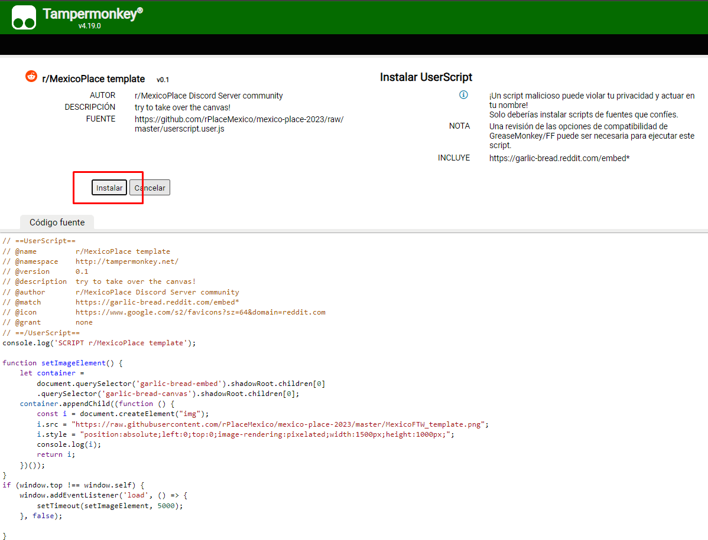
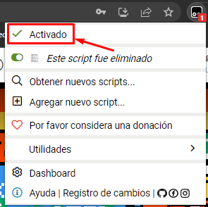

# PLANTILLA DE PIXELES PARA R/MEXICO (JULIO 2023)

## Instrucciones

1. Descargar el plugin/extension Tampermonkey en su navegador:
   - CHROME/OPERA  
     https://chrome.google.com/webstore/detail/tampermonkey/dhdgffkkebhmkfjojejmpbldmpobfkfo?hl=en

     

   - FIREFOX  
     https://addons.mozilla.org/en-US/firefox/addon/violentmonkey/

2. Una vez instalado Tampermonkey, hay que instalar el script entrando a la siguiente dirección:

   **SCRIPT: https://github.com/rPlaceMexico/mexico-place-2023/raw/master/userscript.user.js**

      

  
3. Una vez instalado, abre la pagina de [r/place](https://www.reddit.com/r/place/?screenmode=fullscreen&cx=-229&cy=31&px=104) y deberias ver el diseño pixeleado.
   

##  Solucion de problemas

   #### *No puedo ver el diseño*
   - Si no se visualiza el diseño, prueba actualizando la pagina de [r/place](https://www.reddit.com/r/place/?screenmode=fullscreen&cx=-229&cy=31&px=104).
   - Asegurate que Tampermonkey esta "Activado" dando click en el icono del plugin/extension. 
   - Repite el paso 2 y reinstala el script en Tampermonkey utilizando el link del script.

   #### *Mi diseño esta desactualizado*
   - Repite el paso 2 y reinstala el script en Tampermonkey utilizando el link del script.
## Como funciona

En r/place saldran cuadros pequenos en el lugar del disenio, tenemos que pintar los cuadros de atras grandes del mismo color que el cuadro chiquito

PARA HACER APORTES

1. Editar MexicoFTW.png

   Se debe primero editar la imagen llamada MexicoFTW.png esta tiene el mismo tamaño que el canvas de r/place.
   Cada pixel en la imagen corresponde a un pixel en r/place con las mismas coordenadas. 

2. Ejecutar el script de python dithering.py en la misma carpeta que la imagen.

3. La imagen que genera el script de python debe ser actualizada dentro de este
   repositorio para que se le actualice a TODOS los que usen nuestro Script. 

         
